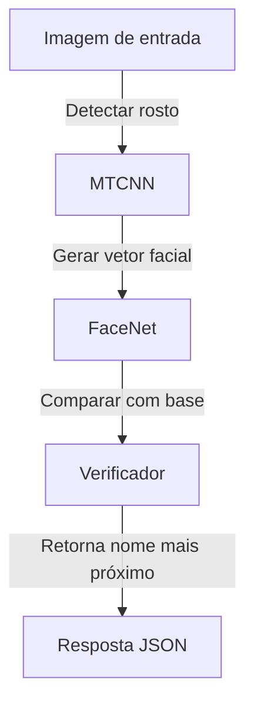

# 🧠 API de Reconhecimento Facial (FaceNet + MTCNN)
**Reconhecimento Facial Inteligente com Java + DL4J + FaceNet + MTCNN**

> Sistema de reconhecimento facial de alto desempenho, projetado para integração em soluções corporativas, embarcadas ou offline.

---

## 📌 Visão Geral

O `api-recognition-facenetMtcnn` é uma aplicação de **reconhecimento facial baseada em Java**, construída sobre a biblioteca **DeepLearning4J (DL4J)**. A aplicação implementa:

* 📷 Detecção de rostos com **MTCNN (Multi-task Cascaded Convolutional Networks)**
* 🧠 Extração de vetores de características com **FaceNet (Inception ResNet V1)**
* 🧮 Verificação facial por **Distância Euclidiana** (padrão) ou **Cosseno**

Essa API fornece endpoints REST simples e eficazes, prontos para serem utilizados em contextos de:

* Controle de acesso com biometria facial
* Autenticação offline
* Integração com sistemas corporativos legados em Java
* Soluções embarcadas para veículos, portarias, eventos e segurança

---

## 🎯 Casos de Uso

| Área                    | Aplicação Real                                                      |
| ----------------------- | ------------------------------------------------------------------- |
| Segurança Patrimonial   | Identificação de pessoas autorizadas em tempo real                  |
| Automação Industrial    | Autenticação de operadores ou acesso a áreas restritas              |
| Varejo                  | Reconhecimento de clientes para atendimento personalizado           |
| Mobilidade/Veículos     | Reconhecimento embarcado em veículos, com hardware de baixo consumo |
| Setor Público / Governo | Cadastro biométrico, programas sociais, controle de presença        |
| Educação                | Registro automático de presença em salas de aula ou laboratórios    |

---

## 🧠 Arquitetura e Tecnologias

* **Java 8+**
* **Spring Boot** para construção da API REST
* **DL4J (DeepLearning4J)** – rede neural para inferência em Java
* **MTCNN** – detecção facial multiescalar robusta
* **FaceNet (Inception ResNet v1)** – extração de embeddings faciais
* **Maven** – build e gerenciamento de dependências
* **REST** – endpoints expostos para fácil integração com frontend, mobile ou outros serviços

---

## 🚀 Como Utilizar

### 📦 Pré-requisitos

* Java 8 ou superior
* Maven 3.3.9+
* IDE Java (recomendado: Spring Tool Suite)

### 🧪 Treinamento de Faces

1. Coloque as imagens de pessoas conhecidas no diretório:

```
imgLibSample/
```

2. Acesse o endpoint:

```
GET http://localhost:9091/api/treinar
```

O sistema processará os rostos e criará a base vetorial para reconhecimento.

### 🔍 Reconhecimento Facial

1. Envie uma imagem para o endpoint:

```
GET http://localhost:9091/api/processar
```

A resposta será o **nome da pessoa reconhecida**, com base na imagem de referência mais próxima.

---

## ⚙️ Endpoints REST

| Método | Rota             | Descrição                                      |
| ------ | ---------------- | ---------------------------------------------- |
| GET    | `/api/treinar`   | Processa novas imagens para inclusão no modelo |
| GET    | `/api/processar` | Processa imagem e retorna identificação        |

> Outras rotas podem ser facilmente adicionadas para upload, listagem, histórico, logs etc.

---

## 📝 Boas Práticas e Recomendações

* ✅ Utilize imagens JPG com até **100 KB** para manter a performance.
* ✅ Mantenha **um único rosto por imagem** para maior precisão.
* ✅ Utilize rostos bem iluminados, centralizados e sem óculos escuros.
* 🚫 Evite imagens com ruído, baixa resolução ou múltiplas faces simultâneas.
* 💾 A base vetorial é mantida em memória — ideal para ambientes de processamento rápido offline.

---

## 🔐 Privacidade e Autonomia

* 🔒 **100% Offline**: Nenhuma dependência de nuvem ou API externa.
* 💻 **Auto-hospedado**: Ideal para instalação em servidores locais, dispositivos embarcados ou edge computing.
* 🧩 **Open Source e Extensível**: Personalize os algoritmos, estrutura de dados, métricas de similaridade ou adicione novos módulos com facilidade.

---

## 📈 Possibilidades de Evolução

* 🔁 **Treinamento incremental com persistência em banco de dados**
* 📷 **Suporte a captura em tempo real por webcam/IP-CAM**
* 🗂️ **Interface web para cadastro, consulta e análise**
* 📊 **Dashboard com estatísticas de reconhecimento**
* 📩 **Notificações por e-mail/webhook ao reconhecer rostos específicos**
* 🔒 **Camada de autenticação na API**
* 💡 **Integração com sensores ou automações (portão, trava, etc.)**

---

## 📸 Exemplo de Fluxo



---

## 🧩 Diferenciais

* Código limpo, orientado a componentes
* Estrutura modular e de fácil entendimento
* Zero dependência de frameworks pesados de IA (como TensorFlow/PyTorch)
* Total compatibilidade com ambientes corporativos em Java
* Pode rodar embarcado ou offline em equipamentos de baixo custo

---

## 🤝 Colaboração

Se você é **empresa, pesquisador ou desenvolvedor** interessado em IA embarcada, biometria ou aplicações de visão computacional, entre em contato para colaborações, consultoria ou expansão do projeto.

---

## 📄 Licença

Este projeto é distribuído sob a Licença MIT.
Você é livre para usar, modificar e distribuir — com os devidos créditos.

Deseja que eu gere o arquivo ou prepare um pacote de deploy?
